# Personalized Affective Perception via Continual Learning Promotes Cooperation in Human-Agent Negotiation

> **Keywords**: Human-Agent Interaction, Automated Negotiation, Affective Computing, Continual Learning, Facial Expression Recognition, Personalization

This repository constitutes the **Official Supplementary Material** for the paper *Personalized Affective Perception via Continual Learning Promotes Cooperation in Human-Agent Negotiation*. It contains the complete source code, the anonymized experimental dataset (N=66), and a one-click reproducibility suite.

---

## 1. System Architecture

The figure below illustrates the complete system architecture, showing the integration of the **CLIFER** module with the negotiation agent:

<p align="center">
  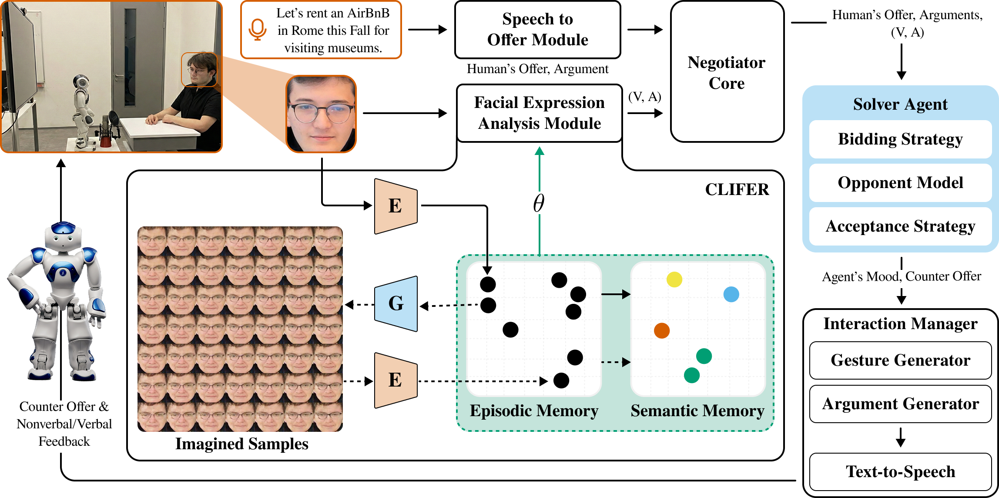
</p>

**Key Components:**

- **Speech to Offer Module**: Converts human verbal offers to structured bids
- **Facial Expression Analysis Module**: Real-time affect perception via CLIFER
- **Negotiator Core**: Manages protocol state, utility space, and offer history
- **Solver Agent**: Decision-making logic (Bidding Strategy, Opponent Model, Acceptance Strategy)
- **CLIFER**: Dual-memory architecture with Episodic (GDM-E) and Semantic (GDM-S) memories

---

## 2. Abstract

Self-interested intelligent agents that negotiate with humans must interpret non-verbal cues, yet static facial-affect models degrade across individuals and contexts, creating a Generalization Gap. We present a framework, **Continual Learning with Imagination for Facial Expression Recognition (CLIFER)**, that embeds Continual Learning into the negotiation strategy to personalize an agent's valence-arousal perception model during interaction, balancing plasticity and stability. Our system combines CLIFER with a dual-thread, asynchronous architecture that updates the model in the background while maintaining responsive, real-time interaction. It modulates negotiation strategy using differential affective feedback. In a counterbalanced within-subject study (N=66) in which participants negotiated with a NAO robot, the CLIFER-enabled agent achieved significantly higher individual utility (p=0.017, d=0.31) than a generic FaceChannel baseline while maintaining comparable joint outcomes. Continual adaptation produced a significant improvement in arousal sensitivity (d=0.88; 95% CI [0.081, 0.169]) affecting 76% of participants positively, and restored theoretically coherent arousal-valence coupling (r=0.45 vs. r=-0.15). Importantly, personalization was associated with a significant increase (32%) in participants' concession rates, suggesting that real-time, continual affective adaptation can promote cooperation in human-agent negotiation under interactive constraints.

---

## 3. Prerequisites

### Hardware Requirements

- **Camera**: Any USB webcam (for facial expression capture)
- **Robot** (optional): NAO, Pepper, or QT robot; Virtual Avatar also supported via Negotiator framework
- **GPU** (recommended): NVIDIA GPU with CUDA support for faster inference

### Software Requirements

- **Python**: 3.8+
- **TensorFlow**: 1.15 or 2.x (for CAAE model)
- **CUDA**: 11.x (optional, for GPU acceleration)
- **cuDNN**: 8.x (optional, for GPU acceleration)

### Trained Models

The pre-trained CAAE (Conditional Adversarial Auto-Encoder) model for imagination is included in `src_code/solver_cl_agent/FaceChannel/CLModel/checkpoint/`.

For the original CLIFER trained models, see the [CLIFER Repository](https://github.com/nchuramani/CLIFER).

---

## 4. Repository Organization

```
├── README.md               # This file
├── LICENSE                 # MIT License
├── requirements.txt        # Python dependencies
├── assets/                 # Figures for documentation
├── final_dataset/          # [DATA] Anonymized experimental results (N=66)
│   ├── experiment_subject_data.csv  # Subject-level metrics
│   ├── experiment_round_data.csv    # Round-level affect data
│   ├── verify_benchmarks.py         # ← [RUN THIS]
│   └── README.md
├── src_code/               # [CODE] Implementation of the CL Agent
│   ├── ARCHITECTURE.md     # Paper-to-code mapping
│   ├── README_CODE.md
│   └── solver_cl_agent/
│       ├── FaceChannel/    # CLIFER Module (Continual Learning)
│       ├── HATN/           # Negotiator Core (Protocol)
│       └── Agent/          # Solver Agent (Decision Logic)
└── statistical_analysis/   # [ANALYSIS] Mixed-effects models
    ├── code/               # Python scripts
    └── reports/            # PDF reports
```

---

## 5. Proposed Method: Implementation Details

Our framework resolves the **Plasticity-Stability Dilemma** in real-time negotiation through a novel dual-memory architecture. The source code provided in `src_code/` implements the following mechanisms:

### 5.1. Generative Replay (CLIFER Module)

Located in `src_code/solver_cl_agent/FaceChannel/CLModel/`:

- **Episodic Memory (GDM-E)**: Dynamic buffer for rapid adaptation to user-specific frames.
- **Semantic Memory (GDM-S)**: CAAE-based long-term memory for stable feature retention.
- **Loss Function**: To prevent catastrophic forgetting, we optimize:

    ```
    L_total = L_real(F_r) + λ · L_imagined(F_gen)
    ```

### 5.2. Differential Affective Feedback (P_E)

Located in `src_code/solver_cl_agent/Agent/Solver_Agent/Solver_Agent.py` (Lines 467-503):

The agent calculates a **Differential Affective Feedback** signal ($P_E$) that decomposes emotional shift into directional and intensity components:

```
# Session-Adaptive Normalization
Ẽ_t = (E_t - μ_t) / (σ_t + ε)

# Directional Sign (handles "Anger Paradox")
P_sign = sgn(ΔV + ΔA)

# Rotation Component (qualitative change)
P_rot = atan2(δ_det, δ_dot)   # normalized by π

# Radial Component (intensity change)  
P_rad = |‖Ẽ_t‖ - ‖Ẽ_{t-1}‖|  # normalized by √2

# Final Signal
P_E = P_sign × min(√(P_rot² + P_rad²), 1.0)
```

where `δ_det = det(Ẽ_{t-1}, Ẽ_t)` and `δ_dot = Ẽ_{t-1} · Ẽ_t`.

<p align="center">
  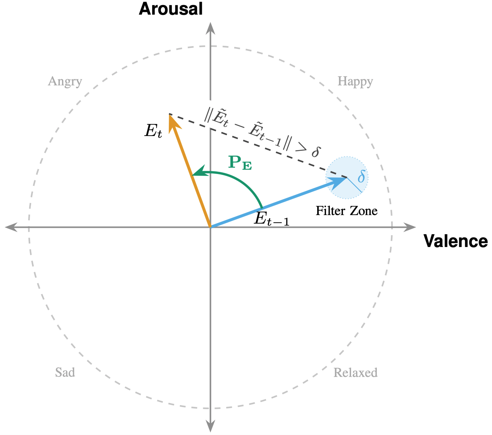
</p>

### 5.3. Asynchronous Architecture

Located in `src_code/solver_cl_agent/main.py`:

- **Thread 1 (Interaction)**: Captures frames and bids using the *frozen* model (θ_curr).
- **Thread 2 (Learning)**: Asynchronously updates weights (θ_train) using Generative Replay and syncs them back.

---

## 6. Experimental Data & Reproducibility

The folder `final_dataset/` contains the anonymized data from our within-subjects study (N=66).

### 6.1. Dataset Description

- **Subjects**: N=66 (Total 132 sessions).

- **Metrics**: Utility, Rounds, Nash Distance, Move Types, Arousal/Valence.
- **Power**: Power ≥0.80 for d=0.35.

### 6.2. Run Verification

To reproduce **Table III** (Outcomes), **Figure 7** (Move Distributions), and **Figure 10** (Affect Analysis) from the paper:

```bash
cd final_dataset
pip install -r ../requirements.txt
python3 verify_benchmarks.py
```

---

## 7. Key Results Summary

### Experimental Procedure

<p align="center">
  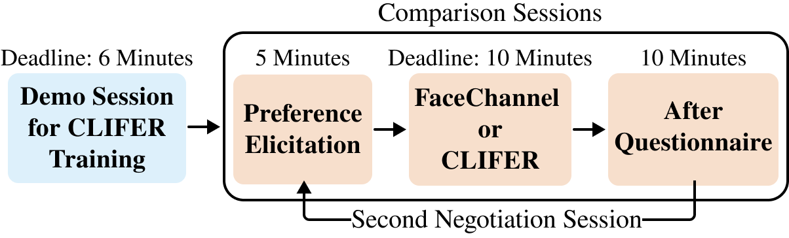
</p>

Each participant negotiated twice with the NAO robot "Solver" in a counterbalanced within-subjects design:

- **Demo Session**: Grocery domain (calibration phase for CL initialization)
- **Session 1 & 2**: Holiday domain with FaceChannel (FC) or CLIFER (CL) conditions

<p align="center">
  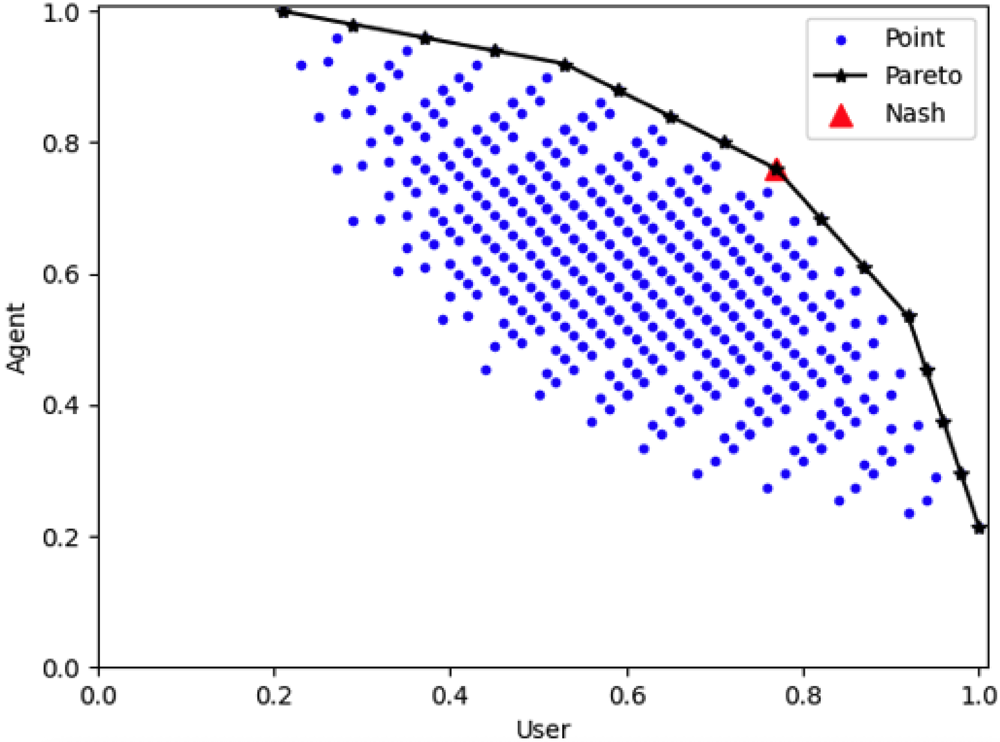
</p>

### 7.1. Affective Perception (RQ1)

<p align="center">
  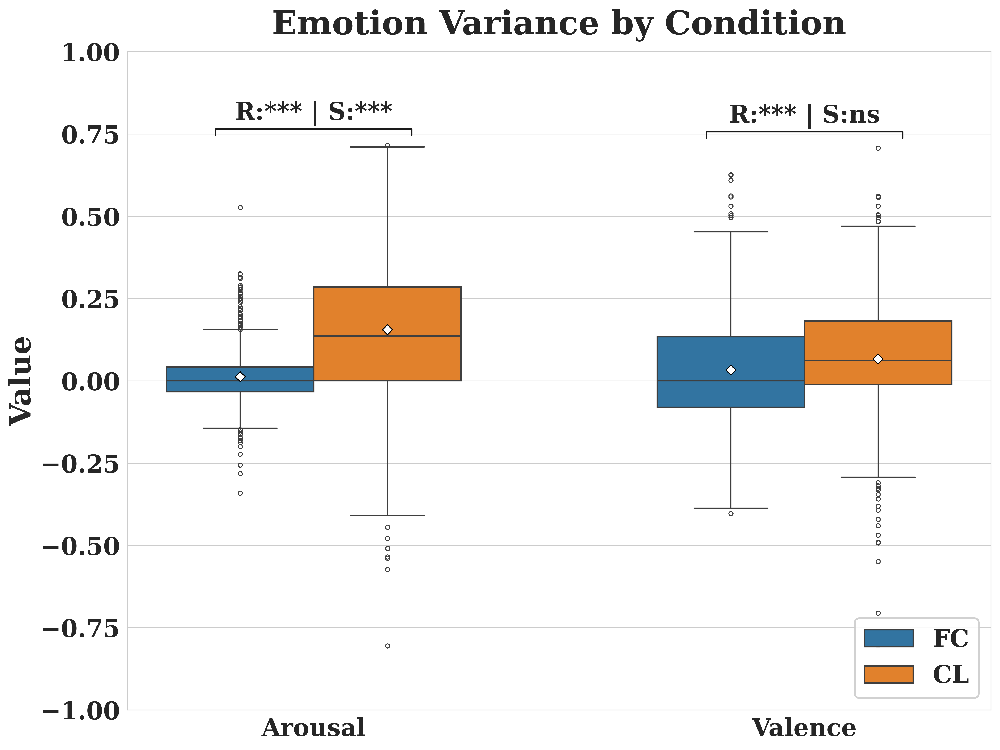
</p>

<div align="center">

| Metric | FC | CL | *p* | *d* |
|--------|----|----|-----|-----|
| **Arousal (Round)** | 0.01 ± 0.09 | **0.15 ± 0.22** | **<0.001** | **0.88** |
| Valence (Round) | 0.03 ± 0.18 | 0.07 ± 0.20 | <0.001 | 0.18 |
| **Arousal (Subject)** | 0.02 ± 0.06 | **0.14 ± 0.16** | **<0.001** | **0.69** |
| Valence (Subject) | 0.03 ± 0.13 | 0.05 ± 0.13 | 0.317 | 0.13 |

</div>

- **Arousal Sensitivity**: CL achieved a large effect size (d=0.88), with **75.8%** of subjects showing improvement.

<p align="center">
  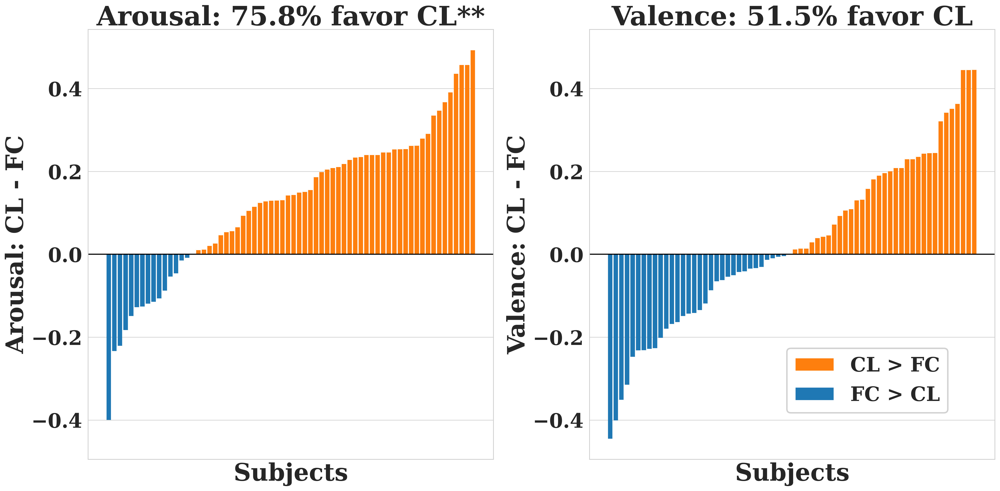
</p>

- **Temporal Stability**: CL maintains superior arousal sensitivity consistently across all negotiation rounds.

<p align="center">
  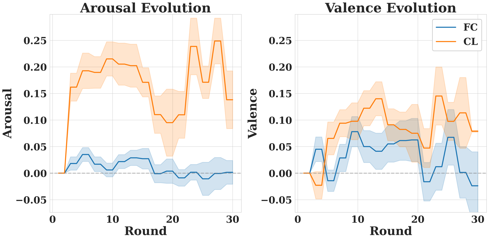
</p>

- **Signal Coupling**: CL restored the positive Arousal-Valence correlation (r=0.45), aligning with Russell's circumplex model.

<p align="center">
  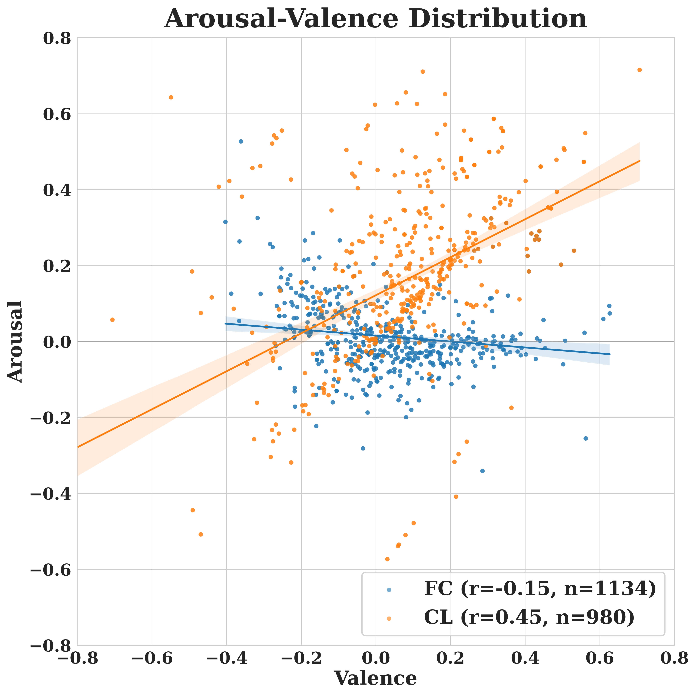
</p>

### 7.2. Behavioral Influence (RQ2)

<p align="center">
  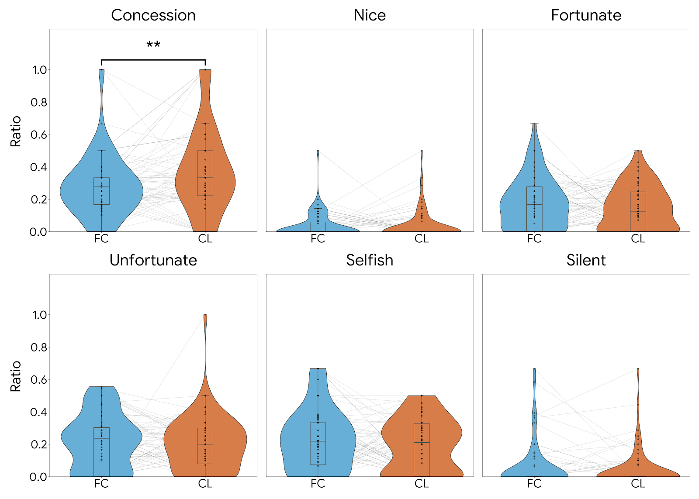
</p>

<div align="center">

| Move Type | FC | CL | *t* | *p* | *d* |
|-----------|----|----|-----|-----|-----|
| **Concession** | 0.28 ± 0.20 | **0.37 ± 0.27** | 2.55 | **0.013** | 0.32 |
| Nice | 0.04 ± 0.08 | 0.04 ± 0.09 | -0.22 | 0.83 | -0.03 |
| Fortunate | 0.18 ± 0.16 | 0.15 ± 0.14 | -0.67 | 0.51 | -0.08 |
| Unfortunate | 0.22 ± 0.17 | 0.20 ± 0.17 | -1.00 | 0.32 | -0.12 |
| Selfish | 0.23 ± 0.19 | 0.19 ± 0.17 | -1.12 | 0.27 | -0.14 |

</div>

- **Concession Rate**: Participants conceded **32% more frequently** with the CL agent (p=0.013, d=0.32).
- **Mechanism**: Stepwise analysis confirms that coherent affective signaling triggered reciprocal cooperation.

### 7.3. Negotiation Outcomes (RQ3)

<p align="center">
  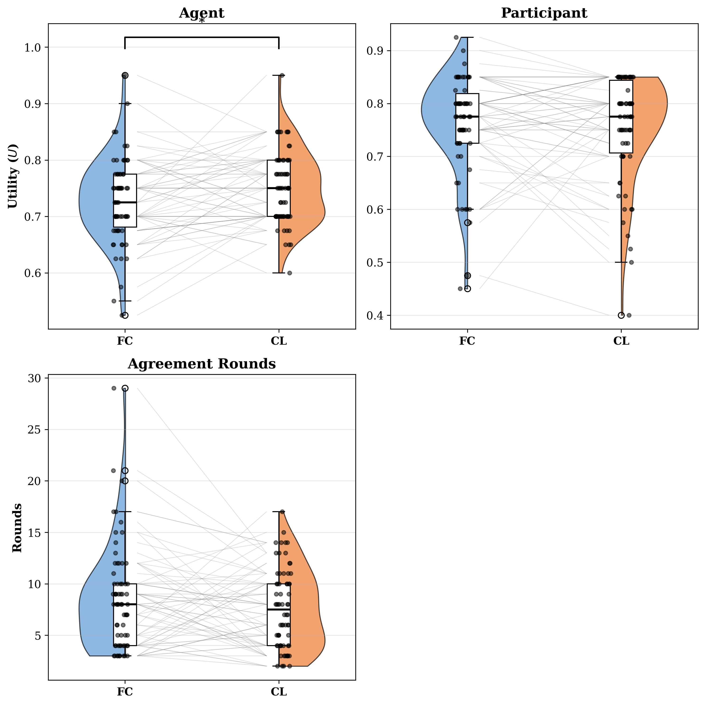
</p>

<div align="center">

| Metric | FC (Mean±SD) | CL (Mean±SD) | *t* | *p* | *d* |
|--------|--------------|--------------|-----|-----|-----|
| **Agent Utility** | 0.73 ± 0.07 | **0.75 ± 0.06** | 2.46 | **0.017** | 0.31 |
| User Utility | 0.76 ± 0.09 | 0.75 ± 0.10 | -0.69 | 0.49 | -0.09 |
| Nash Distance | 0.85 ± 0.08 | 0.88 ± 0.10 | 1.56 | 0.12 | 0.19 |

</div>

- **Agent Utility**: **CL (0.75) > FC (0.73)**, p=0.017, d=0.31. (Significant)
- **Fairness**: User Utility and Nash Distance showed no significant decline, proving the agent did not exploit the human.

### 7.4. Negotiation Efficiency (RQ4)

| Metric | FC (Mean±SD) | CL (Mean±SD) | *t* | *p* | *d* |
|--------|--------------|--------------|-----|-----|-----|
| Agreement Rounds | 8.56 ± 5.02 | 7.61 ± 3.83 | -1.52 | 0.13 | -0.19 |

- **Efficiency**: CL shows 11% faster trend (7.6 vs 8.6 rounds), but did not reach significance (p=0.13).

### 7.5. Subjective Perception (RQ5)

<p align="center">
  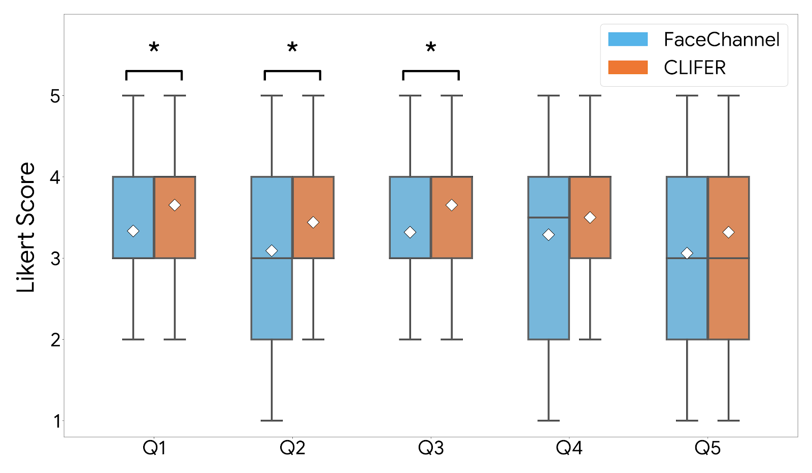
</p>

<div align="center">

| Question | *p* | *d* |
|----------|-----|-----|
| **Q1 (Preference Modelling)**: Solver modelled my preferences accurately | **0.013** | 0.32 |
| **Q2 (Emotional Awareness)**: Solver considered my emotional state | **0.015** | 0.30 |
| **Q3 (Persuasiveness)**: Solver was convincing during the negotiation | **0.043** | 0.26 |
| Q4 (User Decisions): Solver's gestures affected my offer behavior | 0.058 | 0.21 |
| Q5 (Time Awareness): Solver considered the remaining time | 0.121 | 0.19 |

</div>

Participants perceived the CL agent as significantly more emotionally aware and persuasive, supporting the existence of a **"Halo Effect"**.

---

## 8. Related Repositories

This repository builds upon the following foundational work:

<div align="center">

| Component | Repository |
|-----------|------------|
| **CLIFER** (Continual Learning) | [nchuramani/CLIFER](https://github.com/nchuramani/CLIFER) |
| **Negotiator** (HATN Framework) | [berkbuzcu/HumanRobotNego](https://github.com/berkbuzcu/HumanRobotNego) |
| **FaceChannel** | [pablovin/FaceChannel](https://github.com/pablovin/FaceChannel) |

</div>

---

## 9. Citation

```bibtex
@article{PersonalizedAffectivePerception2025,
  title   = {Personalized Affective Perception via Continual Learning Promotes Mutual Cooperation in Human–Agent Negotiation},
  author  = {Anonymous},
  journal = {Under Review},
  year    = {2025}
}
```

---

## 10. License

This project is licensed under the MIT License - see the [LICENSE](LICENSE) file for details.
